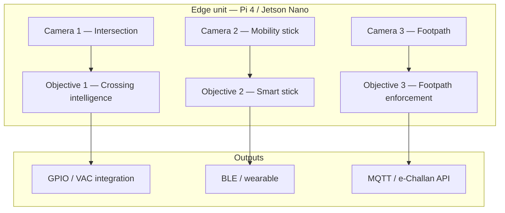
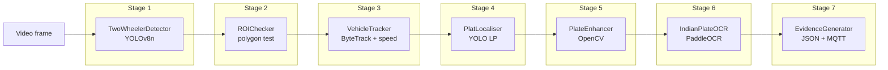
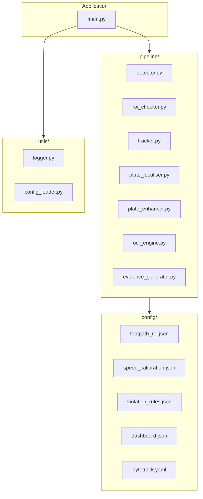

# CrossSafe Edge AI

**CrossSafe** is an **edge-first AI pedestrian safety platform** aligned with the [IoT ML Development Guide](./IoT_ML_Development_Guide.md). All inference is designed to run **on-device** (Raspberry Pi 4 / Jetson Nano): no frames are sent to the cloud for model inference.

This repository currently ships the **full implementation of Objective 3 — Footpath Violation Detection & Auto-Enforcement** under [`objective_3_footpath/`](./objective_3_footpath/). Objectives 1 and 2 are specified in the master guide and share the same edge philosophy and YOLOv8n-centric model strategy.

---

## Table of contents

- [Vision & problem statement](#vision--problem-statement)
- [Relation to the IoT ML Development Guide](#relation-to-the-iot-ml-development-guide)
- [High-level system architecture (all objectives)](#high-level-system-architecture-all-objectives)
- [Objective 3 — modular pipeline architecture](#objective-3--modular-pipeline-architecture)
- [Repository layout](#repository-layout)
- [Quick start (Objective 3)](#quick-start-objective-3)
- [Training, export, and deployment](#training-export-and-deployment)
- [Configuration](#configuration)
- [Hardware & constraints](#hardware--constraints)
- [Evaluation & acceptance (reference)](#evaluation--acceptance-reference)
- [Contributing & citation](#contributing--citation)

---

## Vision & problem statement

| Objective | Problem | Edge output |
|-----------|---------|-------------|
| **Obj 1** | Signals ignore pedestrian vulnerability | VPI-based green extension + alerts |
| **Obj 2** | No real-time road intelligence for VI users | Haptic / audio from stick camera |
| **Obj 3** | Footpath encroachment unenforceable at scale | e-Challan + evidence + MQTT |

**Objective 3** specifically: detect **two-wheelers** on the **footpath ROI**, **track** and estimate **speed**, **localise** the licence plate, **OCR** (Indian format), then **package evidence** and optionally **push** to a dashboard.

---

## Relation to the IoT ML Development Guide

- **Master spec**: [`IoT_ML_Development_Guide.md`](./IoT_ML_Development_Guide.md) — full system philosophy, shared hardware, model budgets, datasets, training machine setup, edge conversion, and acceptance criteria for **all three** objectives.
- **Objective 3 deep-dive**: [`Objective_3_Footpath_Enforcement_ML_Guide.md`](./Objective_3_Footpath_Enforcement_ML_Guide.md) — stage-by-stage pipeline, datasets, training, TFLite/ONNX export, deployment checklist.

Implementation code lives in **`objective_3_footpath/`** and follows the 7-stage pipeline described in both documents.

---

## High-level system architecture (all objectives)

Shared edge platform and camera routing as defined in the master guide:



**Model sharing strategy** (from the guide): one compact **YOLOv8n** family for detection across objectives; Objective 3 uses a **fine-tuned** two-wheeler detector and a separate **plate localiser**, plus **ByteTrack** and **PaddleOCR**.

---

## Objective 3 — modular pipeline architecture

Logical data flow (matches `main.py` and `pipeline/` modules):



**Software module map** (package structure):



| Stage | Module | Responsibility |
|------:|--------|----------------|
| 1 | `pipeline/detector.py` | Two-wheeler detection (+ optional ByteTrack hook) |
| 2 | `pipeline/roi_checker.py` | Footpath polygon / overlap check |
| 3 | `pipeline/tracker.py` | Track IDs, speed (km/h), cooldown |
| 4 | `pipeline/plate_localiser.py` | Plate bbox inside vehicle crop |
| 5 | `pipeline/plate_enhancer.py` | CLAHE, unsharp, bilateral, deskew |
| 6 | `pipeline/ocr_engine.py` | PaddleOCR + Indian LP regex / voting |
| 7 | `pipeline/evidence_generator.py` | Annotated frames, crops, JSON, MQTT |

---

## Repository layout

```
final-iot/
├── README.md                              # This file
├── IoT_ML_Development_Guide.md            # Master spec (all objectives)
├── Objective_3_Footpath_Enforcement_ML_Guide.md
└── objective_3_footpath/
    ├── main.py                            # Inference loop
    ├── requirements_edge.txt              # Pi / Jetson runtime deps
    ├── requirements_training.txt          # GPU training workstation deps
    ├── config/                            # ROI, speed, rules, MQTT, ByteTrack
    ├── pipeline/                          # Stages 1–7
    ├── utils/                             # Logging, config I/O
    ├── scripts/                           # Datasets, calibration, eval, benchmark
    ├── training/                          # Train + export scripts
    ├── deployment/                        # systemd unit + deploy.sh
    ├── models/                            # Weights / exported TFLite (see .gitignore)
    ├── datasets/                          # YOLO data (large image dirs may be gitignored)
    ├── evidence/                          # Runtime violation output (local)
    └── logs/                              # Runtime logs
```

---

## Quick start (Objective 3)

### 1. Edge / dev environment

```bash
cd objective_3_footpath
python -m venv .venv
# Windows: .venv\Scripts\activate
# Linux:   source .venv/bin/activate
pip install -r requirements_edge.txt
```

### 2. Models

- Place **YOLOv8n** base weights under `objective_3_footpath/models/` (e.g. `yolov8n.pt`) for training.
- For **inference**, `main.py` expects exported **`models/twowheeler_int8.tflite`** and **`models/lp_localise_int8.tflite`** after running the export script (see below).

### 3. Calibration (site setup)

```bash
python scripts/calibration_tool.py --source 0
```

Writes / updates `config/footpath_roi.json` and `config/speed_calibration.json`.

### 4. Run inference

```bash
python main.py --source 0 --show
# python main.py --source rtsp://IP/stream1
```

---

## Training, export, and deployment

| Step | Command / script |
|------|------------------|
| Prepare compact YOLO datasets (CPU-friendly) | `python scripts/prepare_training_data.py` |
| Download public datasets (optional; APIs / disk) | `python scripts/download_datasets.py --group all` |
| Merge YOLO sources | `python scripts/merge_datasets.py` (see script `--help`) |
| Train two-wheeler detector | `python training/train_twowheeler.py` |
| Train LP localiser | `python training/train_lp_localiser.py` |
| PaddleOCR fine-tune workflow | `python training/finetune_paddleocr.py` |
| Export TFLite (Pi) / TensorRT notes (Jetson) | `python training/export_models.py --device pi4` |
| Benchmark latency | `python scripts/benchmark_pipeline.py` |
| Evaluate | `python scripts/evaluate_pipeline.py` |
| Linux edge install | `deployment/deploy.sh` + `deployment/pedestrian_ai_obj3.service` |

> **HSTBase / Raspberry Pi**: use `requirements_edge.txt`, exported **INT8 TFLite** models, and the **systemd** unit for auto-start. Jetson path: prefer **TensorRT FP16** where noted in the Objective 3 guide.

---

## Configuration

| File | Purpose |
|------|---------|
| `config/footpath_roi.json` | Footpath polygon, camera id, frame size |
| `config/speed_calibration.json` | `pixels_per_metre`, `camera_fps` |
| `config/violation_rules.json` | Confidences, NMS, speed threshold, cooldown, class names |
| `config/dashboard.json` | MQTT broker, topics, API endpoint |
| `config/bytetrack.yaml` | Tracker parameters |

---

## Hardware & constraints

From the **IoT ML Development Guide**:

- **Targets**: Raspberry Pi 4 (4GB), Jetson Nano (4GB).
- **Philosophy**: edge-only inference; models sized for **latency** and **RAM** budgets.
- **Objective 3** typical stack: YOLOv8n + ByteTrack + YOLO LP + PaddleOCR (ONNX/TFLite on device per your export path).

---

## Evaluation & acceptance (reference)

Use **`scripts/evaluate_pipeline.py`** and the acceptance tables in:

- [`IoT_ML_Development_Guide.md`](./IoT_ML_Development_Guide.md) — Section 11  
- [`Objective_3_Footpath_Enforcement_ML_Guide.md`](./Objective_3_Footpath_Enforcement_ML_Guide.md) — Section 15  

---

## Contributing & citation

1. Fork the repo, branch from `main`, open a PR with a clear description.
2. Keep **edge constraints** in mind when adding models or dependencies.
3. Document new config keys in this README and in `config/` samples.

**Repository**: [github.com/Suraj-creation/CrossSafe-EdgeAI](https://github.com/Suraj-creation/CrossSafe-EdgeAI)

---

## Version control note (what is on GitHub)

To avoid multi‑gigabyte clones and GitHub file limits, **`.gitignore` excludes**:

- `objective_3_footpath/runs/` (Ultralytics training outputs)
- **Merged dataset images and YOLO label folders** under `datasets/merged_*` (regenerate with `scripts/prepare_training_data.py`)
- **`datasets/synthetic_plates/images/`** (regenerate with `scripts/generate_synthetic_plates.py`)
- Local **`evidence/`** and **`logs/*.log`**

Tracked assets include **source code**, **configs**, **`data.yaml`**, **synthetic `labels.txt`**, **`models/yolov8n.pt`**, guides, and this README. For full image datasets, use **Git LFS** or an external artifact bucket if you need them in remote storage.

---

## License

Specify your license in a `LICENSE` file (e.g. MIT, Apache-2.0) when you finalize distribution.

---

## Acknowledgements

- Ultralytics YOLOv8, PaddleOCR, ByteTrack — see `requirements_*.txt` for pinned stack.
- System design and metrics trace to the internal **IoT ML Development Guide** and **Objective 3 Footpath Enforcement ML Guide** included in this repository.
